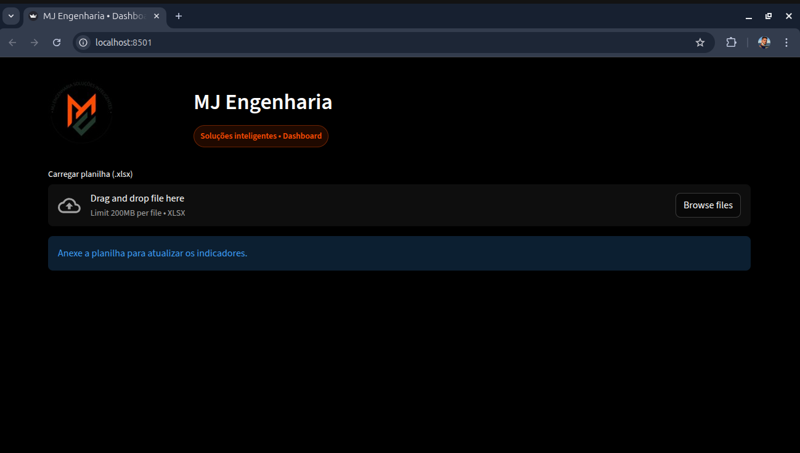
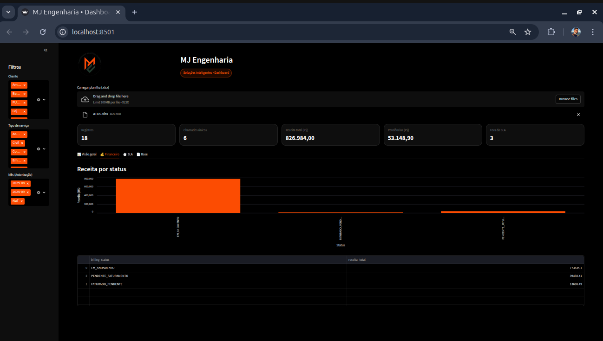
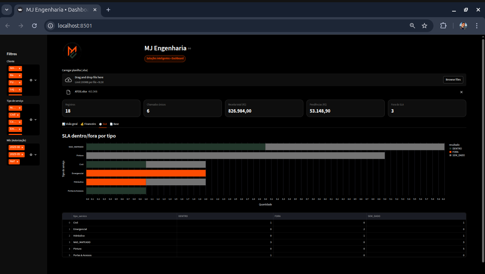

# MJ Engineering — Streamlit Operations Dashboard (Portfolio)

This repository is a portfolio project: a **Streamlit dashboard** that reads an **Excel template** and produces:
- Operational KPIs (tickets/calls per client, demand per month)
- Finance tracking (billing status, pending billing/receivables)
- SLA tracking (inside/outside SLA with configurable rules)
- A filtered dataset export
- Optional **Word report generation** based on current filters (executive summary)

> ⚠️ **No real client data is included** in this repository.  
> Use the provided Excel template (or your own) to test.

## Features
- Upload an `.xlsx` file (Excel template)
- Sidebar filters (Client, Service Type, Month)
- Charts (Altair) + tables
- Config-driven enrichment (service mapping, billing mapping, SLA registry)

## Screenshots

### Overview

### Finance

### SLA

## Project structure
mj-dashboard/
├─ 01_data/
│ ├─ 01_raw/ # input files (not committed)
│ ├─ 02_interim/ # intermediate (not committed)
│ ├─ 03_processed/ # processed (not committed)
│ └─ 04_exports/ # exports (not committed)
├─ 03_app/streamlit/app.py
├─ 04_docs/escopo/ # mappings and SLA registry
└─ 05_reports/logs/ # runtime logs (not committed)
